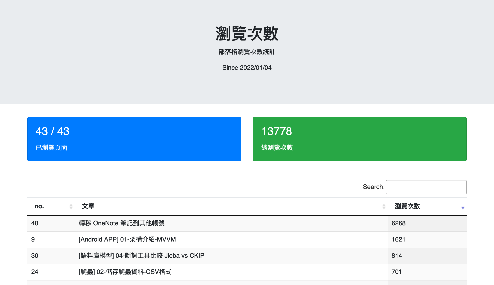

# blog-views
一開始只是打算使用程式列印表格並排序瀏覽次數，但由於標題長度不一，導致表格格線不整齊。為了解決排版問題，嘗試了一些套件，但它們都是以英文半形為基準，而我的標題中使用了中英文混合，導致排版依然不理想。之後又試圖想寫視窗程式，已經忘記當時遇到什麼問題了。反正最後不知道為什麼，簡單的println程式寫著寫著就變網頁了。

這也是我第一次使用Python框架寫網頁呢！


## 建置
本專案使用 Python 的 venv 管理套件

使用Flask，作為網頁框架

套件詳細介紹請參考網路文章，以下只紀錄 Mac 環境的指令步驟

- Clone 專案
```shell
git clone git@github.com:dreambo4/blog-views.git
```

- 下載 Firebase 密鑰
重新命名放到 `config/firebase-credential.json`


- 進入 venv 環境
    > 這是 Mac 的指令，Windows可能要用 activate.bat。
```
cd venv/Scripts
source activate
```

- 安裝相關套件
```
pip3 install Flask
pip3 install firebase_admin
```

- 檢查套件安裝狀況
```
pip3 list

# 檢查套件安裝狀況，大致有這些
Package                  Version
------------------------ --------
altgraph                 0.17.2
blinker                  1.7.0
CacheControl             0.14.0
cachetools               5.3.3
certifi                  2024.2.2
cffi                     1.16.0
charset-normalizer       3.3.2
click                    8.1.7
cryptography             42.0.5
firebase-admin           6.5.0
Flask                    3.0.2
future                   0.18.2
google-api-core          2.18.0
google-api-python-client 2.125.0
google-auth              2.29.0
google-auth-httplib2     0.2.0
google-cloud-core        2.4.1
google-cloud-firestore   2.16.0
google-cloud-storage     2.16.0
google-crc32c            1.5.0
google-resumable-media   2.7.0
googleapis-common-protos 1.63.0
grpcio                   1.62.1
grpcio-status            1.62.1
httplib2                 0.22.0
idna                     3.6
importlib_metadata       7.1.0
itsdangerous             2.1.2
Jinja2                   3.1.3
macholib                 1.15.2
MarkupSafe               2.1.5
msgpack                  1.0.8
pip                      21.2.4
proto-plus               1.23.0
protobuf                 4.25.3
pyasn1                   0.6.0
pyasn1_modules           0.4.0
pycparser                2.22
PyJWT                    2.8.0
pyparsing                3.1.2
requests                 2.31.0
rsa                      4.9
setuptools               58.0.4
six                      1.15.0
uritemplate              4.1.1
urllib3                  2.2.1
Werkzeug                 3.0.2
wheel                    0.37.0
zipp                     3.18.1
```

- 本地運行
```
python3 app.py run
```
